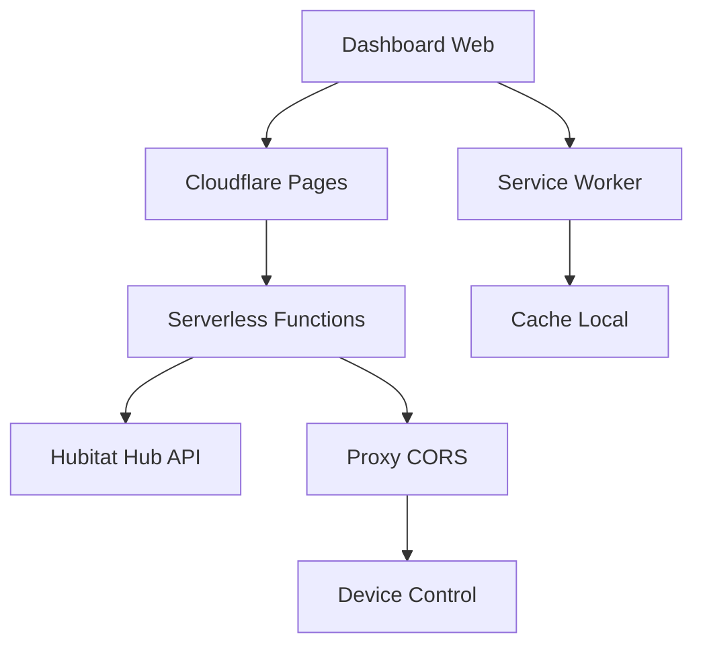

# 🏠 Eletrize Dashboard

> **Dashboard inteligente para controle de automação residencial via Hubitat**

[](https://pages.cloudflare.com)
[](https://web.dev/progressive-web-apps/)
[](#)

Um dashboard moderno e responsivo para controle de dispositivos IoT domésticos, construído com tecnologias web nativas e hospedado no Cloudflare Pages com funcionalidades serverless.

## ✨ Funcionalidades

### 🎛️ **Controle de Dispositivos**
- **Iluminação inteligente** - Controle individual e em grupo
- **TVs e entretenimento** - Liga/desliga equipamentos audiovisuais  
- **Cortinas automáticas** - Abertura, fechamento e parada
- **Smart glass** - Controle de transparência
- **Telas móveis** - Controle de projetores e telas retráteis

### 📱 **Interface Responsiva**
- **Design glassmorphism** com efeitos de vidro translúcido
- **Mobile-first** - Otimizado para uso em tablets e smartphones
- **PWA completa** - Instalável como app nativo
- **Tema escuro elegante** com gradientes modernos

### ⚡ **Performance & Tecnologia**
- **Cloudflare Pages** - Deploy automático e CDN global
- **Serverless Functions** - Proxy para APIs sem CORS
- **Service Worker** - Cache inteligente e funcionamento offline
- **Fallback automático** - Funciona mesmo com APIs indisponíveis

## 🚀 Arquitetura



### 🔧 **Stack Tecnológica**
- **Frontend:** HTML5, CSS3, Vanilla JavaScript
- **Hosting:** Cloudflare Pages
- **Functions:** Cloudflare Workers (Serverless)
- **API:** Hubitat Maker API
- **PWA:** Service Worker, Web App Manifest

## 📦 Deploy & Configuração

### **1. Cloudflare Pages Setup**

```bash
# 1. Fork/Clone este repositório
git clone [seu-fork-url]

# 2. Conecte no Cloudflare Pages
# - Pages > Create project > Connect to Git
# - Selecione seu repositório
# - Build settings: deixe vazio (site estático)
```

### **2. Variáveis de Ambiente**

No painel Cloudflare Pages → **Settings** → **Environment variables**:

```env
HUBITAT_FULL_URL=https://cloud.hubitat.com/api/[YOUR_APP_ID]/devices/all?access_token=[YOUR_TOKEN]
HUBITAT_BASE_URL=https://cloud.hubitat.com/api/[YOUR_APP_ID]/devices  
HUBITAT_ACCESS_TOKEN=[YOUR_ACCESS_TOKEN]
```

> ⚠️ **Substitua** `[YOUR_APP_ID]` e `[YOUR_TOKEN]` pelos seus valores reais

### **3. Configuração Hubitat**

1. **Ative o Maker API** no seu hub Hubitat
2. **Adicione os dispositivos** que deseja controlar
3. **Anote o App ID e Access Token** gerados
4. **Configure CORS** se necessário

## �️ Desenvolvimento Local

```bash
# Servidor de desenvolvimento
python -m http.server 8000
# ou
npx serve .

# Com Cloudflare Wrangler (simula Functions)
wrangler pages dev .
```

### **🔍 API Endpoints**

```javascript
// Buscar estado de dispositivo
GET /functions/polling

// Controlar dispositivo  
GET /functions/hubitat-proxy?device=231&command=on

// Teste de conectividade
GET /functions/test

// Webhook para notificações
POST /functions/webhook
```

## � Instalação como PWA

### **Android/Chrome:**
1. Abra o dashboard no Chrome
2. Menu → "Instalar app" ou banner automático
3. Confirme instalação

### **iOS/Safari:**
1. Abra no Safari
2. Compartilhar → "Adicionar à Tela Inicial"
3. Confirme instalação

## � Personalização

### **Temas & Cores**
Edite `styles.css` para personalizar:
- Gradientes de fundo
- Cores de dispositivos  
- Efeitos glassmorphism
- Layout responsivo

### **Dispositivos**
Edite `script.js` para:
- Adicionar novos dispositivos
- Configurar IDs específicos
- Personalizar comportamentos
- Ajustar polling intervals

## 🔐 Segurança & Privacy

- ✅ **HTTPS obrigatório** via Cloudflare
- ✅ **Tokens não expostos** no frontend
- ✅ **Proxy serverless** evita CORS
- ✅ **Cache local seguro** com Service Worker
- ✅ **Sem dados sensíveis** no repositório público

## 🌟 Demo & Screenshots

> Dashboard responsivo funcionando em múltiplos dispositivos

**Funcionalidades em destaque:**
- Interface moderna com glassmorphism
- Controles touch-friendly para mobile
- Estados em tempo real dos dispositivos
- Animações fluidas e feedback visual

## 📄 Licença

MIT License - Veja [LICENSE](LICENSE) para detalhes.

---

**Desenvolvido com ❤️ para automação residencial moderna**